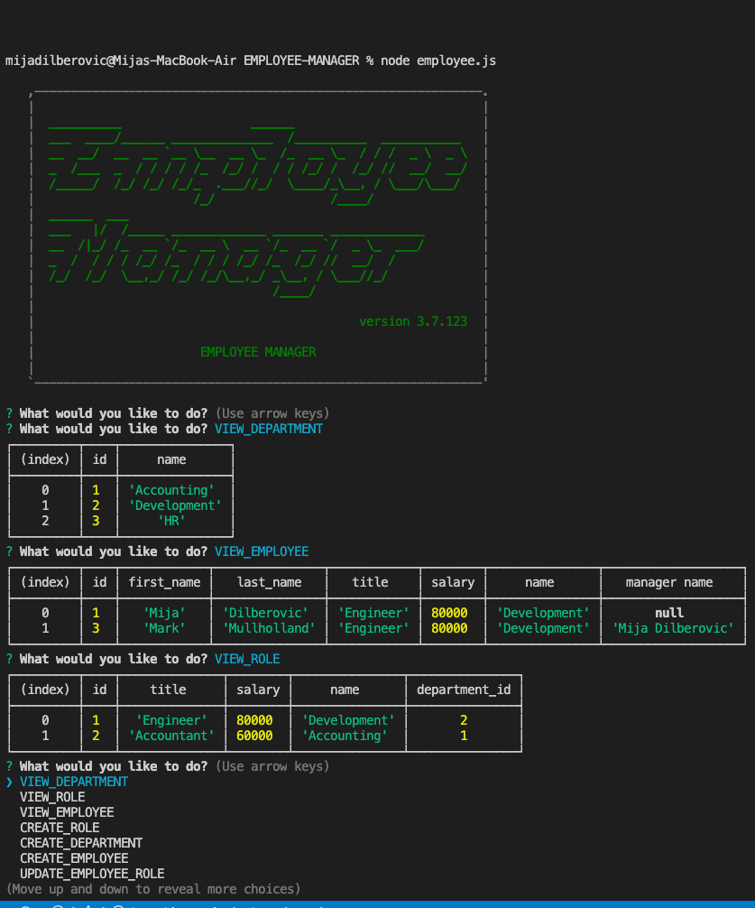

# EMPLOYEE-MANAGER

Employee Tracker System

- [Description](#Description)
- [Installation](#Installation)
- [Usage](#Usage)
- [License](#License)
- [Contributing](#Contributing)
- [Tests](#Tests)
- [Questions](#Questions)

## Description

Content Management System that provides solution for managing company's employees using node, inquirer, and MySQL.

## Table of Contents

## Installation

asciiart-logo, console.table, inquirer and mysql

## Usage

Command Line Application that allows the user to add departments, roles and employees. View departments, roles and employees. Update employee roles and delete departments, roles and employees. Application makes the employee management easy. To initiate the application simply run node. After initiation user is prompted with the list of questions to choose from.

## License

None

## Contributing

Clone the repo and make pull requests to contribute

## Tests

Clone the repo to your local machine

## Questions

- GitHub username Dilberovicka31
- Feel free to contact me for additional questions dilberovicm36@gmail.com

## Image of the application:

## Demo

https://drive.google.com/file/d/1O-fJWvldQz0t07UNhzl2UbxQPn4ACdle/view
